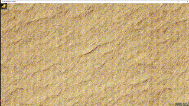
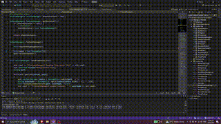
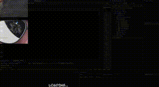
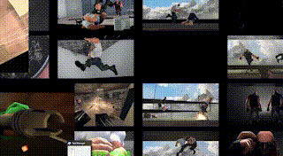

# Parallel Computing

Utilizing multithreading operations for loading large asset files and further exploration into distributed computing.

    <h2>Click to Watch Showcase</h2>
    

### Loading Streaming Assets Images via Threadpooling 
* Main thread renders every frame
* Mutex prevent read (render) and write (add loaded asset to renderlist) race conditions.

<table align="center">
    <tr>
        <td align="center" width=33%></td>
        <td align="center" width=33%></td>
        <td align="center" width=33%></td>
    </tr>
    <tr>
        <td align="center" width=33%><h3>Single Thread</h3></td>
        <td align="center" width=33%><h3>Three Threads</h3></td>
        <td align="center" width=33%><h3>Twenty Threads</h3></td>
    </tr>
</table>

### Multiple Semaphore Video Players as Loading Screen
* Main thread loads the next scene's audio and video.
* One additional dedicated thread for rendering every frame.
* Semaphore threads compete for Permits to animate their individual video sequence.

<table align="center">
    <tr>
        <td align="center" width=50%></td>
        <td align="center" width=50%></td>
    </tr>
    <tr>
        <td align="center" width=50%><h3>Loading Start</h3></td>
        <td align="center" width=50%><h3>Loading Complete</h3></td>
    </tr>
</table>
